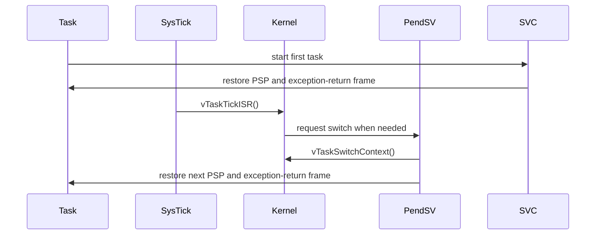

# P9 Design: Cortex-M Port and QEMU Lesson

Status: **Frozen for implementation**  
Target: ARMv7-M Cortex-M3, QEMU `mps2-an385` first board  
Depends on: P0 task contexts, P1 scheduler, P2 tick preemption, P3 delays,
P4 queues and semaphores, P5 mutexes, P6 heaps, P7 software timers, and P8
trace tools and teaching labs

## 1. Purpose and learning outcome

P9 adds the first non-POSIX port to MiniFreeRTOS. The learner should be able
to see how the same kernel policy is connected to real processor mechanisms:

1. reset code builds a vector table and enters C code;
2. a task stack is prepared as an exception-return frame;
3. SVC starts the first task;
4. SysTick advances the kernel clock;
5. PendSV saves the old task context, asks the kernel to select a task, and
   restores the new context;
6. a QEMU lesson demonstrates preemption, delay, IPC, and trace output.

The kernel remains responsible for policy (ready lists, priorities, delays,
waiters, queues, mutexes, timers, and tracing). The port is responsible for
the ARM exception ABI, interrupt masking, and the board's clock/console glue.
The POSIX PC port remains the default host test port and is not replaced by
this milestone.

QEMU's MPS2 model `mps2-an385` is selected because it represents a Cortex-M3
class target and provides a small, deterministic teaching platform. The exact
board model and its emulation differences are documented by QEMU in its
[MPS2 ARM documentation](https://www.qemu.org/docs/master/system/arm/mps2.html).

## 2. Scope

### In scope

- a generic Cortex-M3 port using ARMv7-M exception entry/return;
- a QEMU MPS2 AN385 board layer with vector table, linker script, reset code,
  SysTick setup, and a simple lesson console/exit hook;
- first-task launch through SVC;
- preemptive task switching through PendSV;
- SysTick-to-kernel integration for delay wakeups and time slicing;
- PRIMASK-based critical sections with nesting;
- a separate cross-compilation and QEMU Makefile target;
- an integrated lesson using two tasks, a queue, a delay, and P8 tracing;
- host regressions proving that the POSIX port's behavior is unchanged.

### Non-goals

- STM32, nRF, Raspberry Pi, or any vendor HAL;
- Cortex-M4/M7 floating-point context, lazy FPU stacking, or DSP extensions;
- MPU isolation, TrustZone, SMP, tickless idle, low-power clock switching,
  nested application ISR APIs, or production-grade fault recovery;
- a CMSIS dependency;
- a second physical board port;
- changing the scheduling, queue, mutex, timer, heap, or trace semantics;
- making the POSIX scheduler emulate ARM exceptions.

## 3. Constraints discovered before implementation

The current workspace has a host C compiler and Python, but it does not have
`arm-none-eabi-gcc`, `arm-none-eabi-objdump`, `arm-none-eabi-size`, or
`qemu-system-arm`. Therefore the implementation can be reviewed locally, but
the ARM image and QEMU acceptance suite require those tools to be installed in
the build environment. P9 must not silently fall back to a host executable and
call that a Cortex-M result.

The existing kernel still includes a few hosted-C conveniences (`stdio.h`,
formatted diagnostics, and `abort`) in code paths used by the PC lesson. The
Cortex-M build must either provide explicit freestanding shims or exclude
host-only diagnostics at compile time. It must never use a C library allocator:
the existing `heap_1`, `heap_2`, and `heap_4` implementations remain the sole
task/IPC allocation choices.

## 4. Architecture and port boundary

The current POSIX port combines scheduler driving and context switching in a
host loop. P9 separates those responsibilities without changing the public
task API:

| Layer | Owns | Must not own |
|---|---|---|
| Kernel scheduler | ready lists, selected task, state transitions, tick policy | registers, exception return, MMIO |
| Common port contract | task context type, start/yield hooks, critical API | ready-list policy or wait queues |
| POSIX port | `ucontext`/host loop and signal tick | ARM vector/stack rules |
| Cortex-M port | PSP/MSP, SVC, PendSV, PRIMASK, SysTick glue | task priority selection |
| QEMU board layer | vector table, reset, clock addresses, console, exit | generic kernel decisions |

The kernel receives a port-selected `PortContext_t` in each TCB. A port may
store private data in it, but the kernel only passes the owning TCB back to the
port and never interprets register fields. Internal scheduler hooks are kept
separate from application-facing APIs:

```c
/* kernel-internal, not an application API */
void vTaskSwitchContext(void);
void vTaskTickISR(void);
void vTaskEndSchedulerInternal(void);
```

`vTaskSwitchContext` commits `pxCurrentTCB` to the highest-priority ready task
and records the P8 task-switch event. It does not save or restore registers.
The port calls it only from its context-switch path. `vTaskTickISR` performs
the existing tick bookkeeping and requests a switch when policy says one is
needed; it does not directly manipulate an ARM stack.

The common port contract is selected by the port include path and contains the
following conceptual operations (exact names may follow existing conventions):

```c
typedef struct PortContext PortContext_t;

void vPortInitialiseTask(PortContext_t *context,
                         void (*entry)(void *), void *argument,
                         uint32_t *stack_low, size_t stack_words);
void vPortStartScheduler(void);       /* does not return on Cortex-M */
void vPortEndScheduler(void);
void vPortYieldTask(void);
void vPortYieldFromISR(void);
void vPortEnterCritical(void);
void vPortExitCritical(void);
void vPortStartTick(void);
void vPortStopTick(void);
```

The POSIX implementation maps these calls to its existing scheduler context,
signal mask, and host tick loop. The Cortex-M implementation maps them to
exception and register operations. No generic kernel header may include
`ucontext.h` or an ARM assembly header.

## 5. Cortex-M task context and stack frame

Each Cortex-M task owns an aligned stack supplied by the existing task/heap
creation path. `PortContext_t` contains the saved process stack pointer (PSP):

```c
typedef struct PortContext {
    uint32_t *saved_psp;
} PortContext_t;
```

`vPortInitialiseTask` places the initial frame at the top of the stack. The
frame is compatible with the hardware exception return performed by SVC or
PendSV:

| Frame item | Initial value |
|---|---|
| R0 | task argument |
| R1-R3 | zero |
| R12 | zero |
| LR | task-return trap (`vPortTaskExitError`) |
| PC | a C trampoline that calls the task entry |
| xPSR | `0x01000000` (Thumb bit) |
| R4-R11 | zero, saved by PendSV software prologue |

The stack is rounded down to an 8-byte boundary before the frame is written.
The trampoline calls the task entry once. Returning from the entry is a
programming error: `vPortTaskExitError` records a diagnostic (when enabled),
asks the kernel to delete/stop according to the existing lesson policy, and
parks the CPU if no continuation is available. P9 does not invent a new public
task-exit API.

No hard-coded TCB byte offset is used in assembly. PendSV calls small C helpers
or port accessors to obtain the current and next task's `saved_psp`; this keeps
the assembly stable if the common TCB grows for a later milestone.

## 6. Exception and interrupt flow

The intended control flow is:



### Reset and SVC

`Reset_Handler` performs minimal data/BSS initialization, sets MSP from the
linker-provided stack symbol, calls `vBoardEarlyInit`, creates the lesson's
static/dynamic tasks, and invokes `vTaskStartScheduler`. The Cortex-M port's
start hook sets PendSV/SysTick priorities, starts SysTick, and executes SVC.

`SVC_Handler` loads the first task's saved PSP, selects PSP for thread mode,
unmasks interrupts, and returns with the exception-return value that restores
the prepared hardware frame. SVC is only used for initial launch; ordinary
preemption uses PendSV.

### PendSV

`PendSV_Handler` is a small naked assembly routine:

1. read PSP;
2. push software-saved R4-R11 onto the current task's stack;
3. publish that stack pointer through the current task's port accessor;
4. call `vTaskSwitchContext` with interrupts masked by the exception priority;
5. load the selected task's saved PSP;
6. pop R4-R11;
7. write PSP and return using the standard thread-mode exception frame.

PendSV is configured at the lowest configurable exception priority. SysTick
never performs a register-level context switch and therefore cannot corrupt a
partially stacked task frame.

### SysTick

The board layer programs the SysTick reload value from configuration:

```text
reload = (configSYSTICK_CLOCK_HZ / configTICK_RATE_HZ) - 1
```

`configSYSTICK_CLOCK_HZ` is supplied by the board configuration rather than
being guessed by generic code. The handler clears/acknowledges the peripheral
as required by the target and calls `vTaskTickISR`, followed by
`vPortYieldFromISR` if the kernel requested a switch. The trace tick event,
when enabled, is emitted by the existing kernel tick path, not by the board
driver.

## 7. Critical sections and interrupt priorities

The Cortex-M port uses PRIMASK for the first teaching implementation:

- `vPortEnterCritical` disables maskable interrupts with `cpsid i` and
  increments a per-thread/kernel nesting counter;
- `vPortExitCritical` decrements the counter and executes `cpsie i` only when
  the outermost critical section ends;
- ISR entry never calls the task-level enter/exit pair;
- SysTick and PendSV run with the architectural exception rules and do not
  re-enable interrupts in the middle of a kernel commit.

The port must preserve the previous PRIMASK state when an outer caller entered
with interrupts already disabled. A debug build may assert balanced nesting.
P9 does not expose interrupt-priority APIs to applications and does not claim
the stronger BASEPRI behavior needed by a production Cortex-M port.

## 8. Startup, linker, and board files

The proposed source layout is:

```text
portable/cortex_m/
  port.c                 common Cortex-M C helpers and critical sections
  portmacro.h            PortContext_t and port contract
  port_frame.c           architecture-neutral initial stack-frame builder
  portasm.S              SVC/PendSV handlers
  freestanding.c         optional libc/assert shims for the ARM build
  qemu_mps2_an385/
    board.c              SysTick MMIO, console, QEMU exit hook
    board.h              clock and board constants
    startup.S            vector table, Reset, default fault handlers
    linker.ld            flash/RAM regions and stack symbols

examples/09_cortex_m/
  main.c                 deterministic two-task lesson
  README.md              build, run, and expected output
```

The vector table is linked at address zero and contains the initial MSP,
Reset, NMI, HardFault, SVC, PendSV, and SysTick entries. Unimplemented vectors
use a common default handler that reports a failure through the board console
and then loops in `wfi`. The linker script places code/rodata in the emulated
flash region, data/BSS and task stacks in RAM, and emits symbols used by
`startup.S`.

The generic port has no UART or semihosting dependency. The QEMU board layer
provides `vBoardConsoleWrite` and `vBoardExit(int status)` for the lesson. A
semihosting adapter is acceptable for the first QEMU lesson; it is explicitly
board/demo glue and must not leak into kernel APIs. If newlib/nosys is used,
the board supplies the minimal `_write` and `_exit` hooks needed by diagnostics.

## 9. Freestanding kernel boundary

P9 must make the ARM build honest and reproducible:

1. compile kernel and port sources with `-mcpu=cortex-m3 -mthumb
   -ffreestanding -fno-builtin -ffunction-sections -fdata-sections`;
2. link with the board linker script, `--gc-sections`, and an explicitly chosen
   runtime (`nosys` or the documented minimal shims);
3. keep all allocation in the selected MiniFreeRTOS heap implementation;
4. guard host-only formatted output and `abort` behind a port/configuration
   switch, replacing them with `vBoardConsoleWrite`/`vPortTaskExitError` on
   Cortex-M;
5. fail the build if a Cortex-M translation unit includes POSIX headers or
   references `ucontext`, `pthread`, or host signal APIs.

The first implementation may retain the existing public diagnostics API if
the freestanding shim is small and documented. It must not introduce a second
allocator or silently link a hosted process runtime.

## 10. Configuration

Add guarded defaults only where they are genuinely port-specific:

```c
#ifndef configCPU_CLOCK_HZ
#define configCPU_CLOCK_HZ       25000000UL /* board may override */
#endif

#ifndef configSYSTICK_CLOCK_HZ
#define configSYSTICK_CLOCK_HZ   configCPU_CLOCK_HZ
#endif

#ifndef configKERNEL_INTERRUPT_PRIORITY
#define configKERNEL_INTERRUPT_PRIORITY 0xFFU
#endif
```

The board configuration is allowed to override the clock after the actual
QEMU model is verified; generic code must not assume that the example value is
universal. Existing task, heap, trace, and timer configuration names keep their
P0-P8 meaning. A Cortex-M build selects its port through the build system, not
through runtime detection.

## 11. Build and run interface

Keep the existing `Makefile` as the host/POSIX entry point. Add
`Makefile.cortex_m` (or an equivalent clearly named include) with:

```text
CROSS_COMPILE ?= arm-none-eabi-
CPU_FLAGS     := -mcpu=cortex-m3 -mthumb
FREESTANDING  := -ffreestanding -fno-builtin

make -f Makefile.cortex_m all
make -f Makefile.cortex_m size
make -f Makefile.cortex_m qemu
```

The QEMU target uses the AN385 machine, the generated ELF/binary, no network,
and the documented console/semihosting flags. `make test` continues to mean
the host regression suite. If a required ARM tool is absent, the ARM target
fails with an actionable prerequisite message and never runs a host binary.

## 12. P9 teaching lesson

`examples/09_cortex_m` creates two tasks at different priorities plus a queue:

- a producer periodically sends an incrementing value and calls the existing
  delay API;
- a consumer blocks on the queue, records each value, and yields/blocks;
- after a fixed number of messages, the lesson stops the scheduler and asks
  the board exit hook to return status zero.

The lesson enables P8 trace recording and prints a compact deterministic
summary before exit. It must demonstrate at least one SysTick-driven wakeup,
one PendSV switch, one queue send/receive, and one task running at a higher
priority than the other. The summary is intentionally small; the existing
host `trace_report.py` remains the rich trace-analysis tool.

## 13. Acceptance criteria

The P9 PR is acceptable only when all of the following are true:

1. **Host regression:** the complete P0-P8 host test, example, trace, and UBSan
   checks pass with no behavior change.
2. **Cross compile:** the ARM build succeeds with warnings treated as errors,
   produces an ELF/map, and has no POSIX/ucontext/host-signal references.
3. **Image structure:** an object/symbol check proves the vector table is at
   address zero, Reset/SVC/PendSV/SysTick are present, and the initial task
   frame has the Thumb xPSR and trampoline PC.
4. **Boot:** QEMU reaches Reset, starts the first task through SVC, and prints
   the lesson banner without a fault handler.
5. **Preemption:** QEMU output/trace proves SysTick advances, a delayed task
   wakes, and PendSV preserves independent task stack locals across switches.
6. **IPC and priority:** the queue transfer completes in order and the
   higher-priority consumer preempts the producer after a wakeup.
7. **Critical section:** a short critical-section probe shows that a tick does
   not switch tasks in the protected interval and that nesting balances.
8. **Shutdown:** the fixed lesson exits through the board hook with status 0;
   a default/fault handler reports failure and does not return.
9. **Trace compatibility:** P8 event names/ordering remain valid; no trace
   event changes scheduling or allocates memory.
10. **Documentation:** `examples/09_cortex_m/README.md` states exact tool
    versions/commands, expected output, and the known QEMU-vs-hardware limits.

## 14. Implementation order after approval

1. Freeze this document and record any accepted changes in a short changelog.
2. Extract the common port contract and scheduler hook while keeping POSIX
   tests green after each small change.
3. Add the Cortex-M context initializer, SVC/PendSV assembly, and unit-level
   stack-frame checks.
4. Add AN385 startup/linker/board files and a minimal boot-only image.
5. Integrate SysTick, delay wakeups, critical sections, and the lesson.
6. Add freestanding shims and the cross/QEMU Makefile targets.
7. Run host tests, ARM static checks, cross compilation, QEMU acceptance, and
   UBSan host checks; then open one P9 PR for review.
